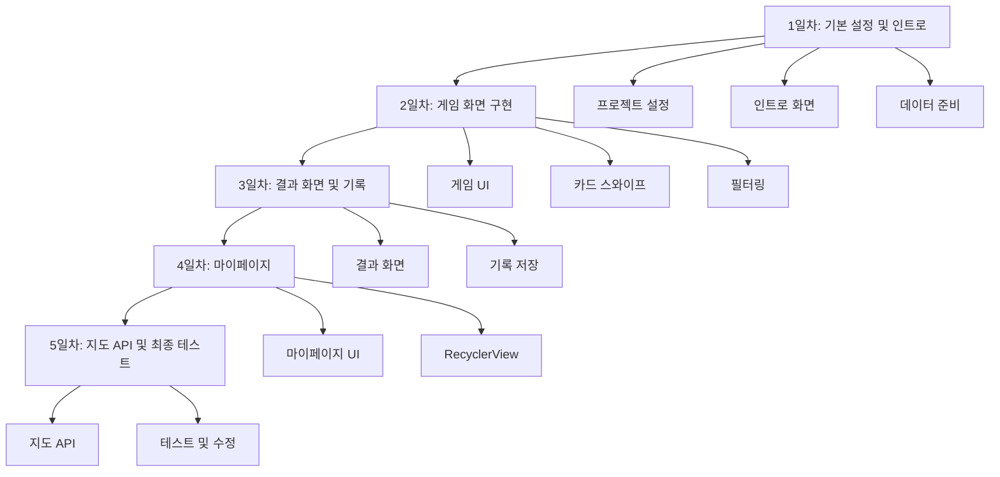

# 5일 개발 계획 - 음식 메뉴 월드컵 앱

## 전체 개발 흐름

## 1일차: 기본 설정 및 인트로 화면 (4-6시간)

### 목표

- 프로젝트 환경 설정 완료
- 인트로 화면 구현
- 음식 데이터 준비

### 작업 내용

#### 1.1 프로젝트 기본 설정 (1시간)

- [AndroidManifest.xml](2025Winter_1st-main/app/src/main/AndroidManifest.xml) 확인 및 수정
  - Application ID 확인
  - Activity 등록 (IntroActivity를 launcher로 설정)
  - 인터넷 권한 추가 (지도 API용)
- 빌드 확인 및 라이브러리 동기화

#### 1.2 인트로 화면 구현 (2시간)

- [activity_intro.xml](app/src/main/res/layout/activity_intro.xml) 레이아웃 작성
  - 앱 로고/제목
  - 앱 소개 텍스트
  - "게임 시작" 버튼
- [IntroActivity.kt](app/src/main/java/com/example/foodworldcup/ui/IntroActivity.kt) 구현
  - 버튼 클릭 시 GameActivity로 이동하는 Intent 처리

#### 1.3 음식 데이터 준비 (2-3시간)

- [FoodRepository.kt](app/src/main/java/com/example/foodworldcup/data/FoodRepository.kt) 데이터 추가
  - 최소 16개 이상의 음식 데이터 추가 (토너먼트 진행을 위해)
  - 한식, 중식, 양식, 일식 등 카테고리별로 분류
  - `getFoodListByCategory()` 함수 구현
  - `getAllCategories()` 함수 구현
- 음식 이미지 리소스 준비
  - res/drawable 폴더에 음식 이미지 추가
  - FoodRepository의 imageResId 연결

### 완료 기준

- 인트로 화면에서 게임 시작 버튼 클릭 시 GameActivity로 이동
- FoodRepository에 최소 16개 음식 데이터 추가 완료
- 카테고리 필터링 함수 동작 확인

---

## 2일차: 게임 화면 구현 (4-6시간)

### 목표

- 게임 화면 UI 완성
- 카드 스와이프 기능 구현
- 카테고리 필터링 기능 구현
- 토너먼트 로직 구현

### 작업 내용

#### 2.1 게임 화면 레이아웃 (1.5시간)

- [activity_game.xml](app/src/main/res/layout/activity_game.xml) 작성
  - 상단: 카테고리 토글 버튼 (전체, 한식, 중식, 양식 등)
  - 중앙: CardStackView 또는 SwipeView
  - 하단: 현재 라운드 표시 (선택사항)

#### 2.2 카드 스와이프 구현 (2-3시간)

- [GameActivity.kt](app/src/main/java/com/example/foodworldcup/ui/GameActivity.kt) 구현
  - CardStackView 어댑터 작성 또는 SwipeView 설정
  - 음식 데이터를 카드에 표시 (이름, 이미지)
  - 좌우 스와이프 이벤트 처리
  - 선택된 음식을 다음 라운드로 진출시키는 로직

#### 2.3 토너먼트 로직 구현 (1.5-2시간)

- 토너먼트 진행 로직
  - 현재 라운드의 두 음식 표시
  - 선택 시 다음 라운드로 진행
  - 최종 우승 음식 결정
  - 모든 라운드 종료 시 ResultActivity로 이동 (Intent로 우승 음식 전달)

#### 2.4 카테고리 필터링 (1시간)

- `filterByCategory()` 함수 구현
- 토글 버튼 클릭 시 해당 카테고리 음식만 필터링
- 필터링된 리스트로 게임 재시작 

### 완료 기준

- 카드 스와이프로 음식 선택 가능
- 카테고리 필터링 동작 확인
- 토너먼트 완료 시 ResultActivity로 이동

---

## 3일차: 결과 화면 및 기록 저장 (4-6시간)

### 목표

- 결과 화면 구현
- 우승 기록 저장 기능 구현
- PreferenceManager 완성

### 작업 내용

#### 3.1 결과 화면 UI (1.5시간)

- [activity_result.xml](app/src/main/res/layout/activity_result.xml) 작성
  - 우승 음식 이미지 표시 영역
  - 우승 음식 이름 표시
  - 버튼 영역 (다시하기, 마이페이지, 지도 보기)

#### 3.2 결과 화면 로직 (1.5시간)

- [ResultActivity.kt](app/src/main/java/com/example/foodworldcup/ui/ResultActivity.kt) 구현
  - GameActivity로부터 우승 음식 데이터 받기
  - `displayWinner()` 함수 구현 (Glide로 이미지 로딩)
  - 버튼 클릭 이벤트 처리
    - 다시하기: GameActivity로 이동
    - 마이페이지: MyPageActivity로 이동
    - 지도 보기: MapActivity로 이동 (우승 음식 전달)

#### 3.3 PreferenceManager 구현 (2시간)

- [PreferenceManager.kt](app/src/main/java/com/example/foodworldcup/utils/PreferenceManager.kt) 완성
  - `saveWinRecords()` 함수 구현 (Gson 사용)
  - `getWinRecords()` 함수 구현
  - `addWinRecord()` 함수 구현
  - `clearWinRecords()` 함수 구현
- WinRecord의 Date 직렬화 처리 (Gson 커스텀 어댑터 필요할 수 있음)

#### 3.4 기록 저장 연동 (1시간)

- ResultActivity에서 우승 기록 저장
  - `saveWinRecord()` 함수 구현
  - 우승 시 자동으로 기록 저장

### 완료 기준

- 결과 화면에 우승 음식 표시
- 우승 기록이 SharedPreferences에 저장됨
- 모든 버튼 동작 확인

---

## 4일차: 마이페이지 구현 (4-6시간)

### 목표

- 마이페이지 UI 완성
- RecyclerView로 우승 기록 리스트 표시
- 기록 삭제 기능 구현

### 작업 내용

#### 4.1 마이페이지 레이아웃 (1.5시간)

- [activity_mypage.xml](app/src/main/res/layout/activity_mypage.xml) 작성
  - RecyclerView 추가
  - 빈 화면 메시지 TextView (기록이 없을 때)
  - 기록 삭제 버튼 (선택사항)
  - 홈으로 버튼

#### 4.2 RecyclerView 어댑터 작성 (2-3시간)

- WinRecordAdapter.kt 생성
  - ViewHolder 패턴 구현
  - 레이아웃: item_win_record.xml 작성
    - 음식 이름
    - 우승 날짜/시간
    - (선택사항) 음식 이미지
  - 데이터 바인딩

#### 4.3 마이페이지 로직 (1.5-2시간)

- [MyPageActivity.kt](app/src/main/java/com/example/foodworldcup/ui/MyPageActivity.kt) 구현
  - `loadWinRecords()` 함수 구현
  - `setupRecyclerView()` 함수 구현
  - 기록이 없을 때 빈 화면 표시
  - 기록 삭제 기능 (선택사항)
  - onResume()에서 최신 기록 다시 불러오기

### 완료 기준

- 마이페이지에 우승 기록 리스트 표시
- 기록이 시간순으로 정렬되어 표시
- 기록 삭제 기능 동작 확인

---

## 5일차: 지도 API 연동 및 최종 테스트 (4-6시간)

### 목표

- 지도 화면 구현
- Google Maps Places API 연동
- 전체 앱 테스트 및 버그 수정

### 작업 내용

#### 5.1 Google Cloud Console 설정 (1시간)

- Google Cloud Console에서 프로젝트 생성
- Maps SDK for Android 활성화
- Places API 활성화
- API 키 발급

#### 5.2 AndroidManifest 설정 (30분)

- [AndroidManifest.xml](2025Winter_1st-main/app/src/main/AndroidManifest.xml) 수정
  - API 키 메타데이터 추가
  - 위치 권한 추가 (ACCESS_FINE_LOCATION, ACCESS_COARSE_LOCATION)
  - MapActivity 등록

#### 5.3 지도 레이아웃 (1시간)

- [activity_map.xml](app/src/main/res/layout/activity_map.xml) 작성
  - SupportMapFragment 또는 MapView 추가
  - 검색 중 로딩 인디케이터
  - 음식점 정보 표시 영역 (선택사항)

#### 5.4 MapApiHelper 구현 (2-3시간)

- [MapApiHelper.kt](app/src/main/java/com/example/foodworldcup/api/MapApiHelper.kt) 완성
  - Places API 클라이언트 초기화
  - `searchRestaurants()` 함수 구현
    - Text Search 또는 Nearby Search 사용
    - 음식 이름 + "음식점"으로 검색
  - `parsePlacesResponse()` 함수 구현
  - API 키를 strings.xml 또는 BuildConfig로 관리

#### 5.5 MapActivity 구현 (1.5-2시간)

- [MapActivity.kt](app/src/main/java/com/example/foodworldcup/ui/MapActivity.kt) 완성
  - 위치 권한 요청 및 처리
  - Google Maps 초기화
  - 현재 위치 가져오기 (FusedLocationProviderClient)
  - `searchNearbyRestaurants()` 함수 구현
  - `displayRestaurantsOnMap()` 함수 구현
    - 검색된 음식점을 마커로 표시
    - 마커 클릭 시 정보 표시

#### 5.6 최종 테스트 및 버그 수정 (1-2시간)

- 전체 앱 플로우 테스트
  - 인트로 → 게임 → 결과 → 마이페이지
  - 인트로 → 게임 → 결과 → 지도
- 버그 수정
- UI/UX 개선 (필요시)

### 완료 기준

- 지도 화면에서 주변 음식점 검색 및 표시
- 마커 클릭 시 음식점 정보 표시
- 전체 앱 동작 확인

---

## 일일 체크리스트

각 일차 종료 시 확인사항:

- [ ] 해당 일차의 완료 기준 달성
- [ ] 빌드 에러 없음
- [ ] 기본 동작 테스트 완료
- [ ] 다음 일차 작업 준비 완료

## 주의사항

1. **API 키 관리**: Google Maps API 키는 절대 Git에 커밋하지 말고, strings.xml이나 BuildConfig로 관리
2. **이미지 리소스**: 음식 이미지는 적절한 크기로 최적화 (용량 고려)
3. **에러 처리**: 네트워크 오류, 권한 거부 등 예외 상황 처리
4. **성능**: RecyclerView의 ViewHolder 패턴 준수, 이미지 로딩 최적화

## 예상 위험 요소

- Google Maps API 설정 복잡도 (5일차)
- Places API 할당량 초과 가능성 (테스트 시 주의)
- 위치 권한 거부 시 처리

## 대안 계획

- 지도 API 연동이 어려울 경우: 5일차에 기본 지도 표시만 구현하고, Places API는 추후 추가