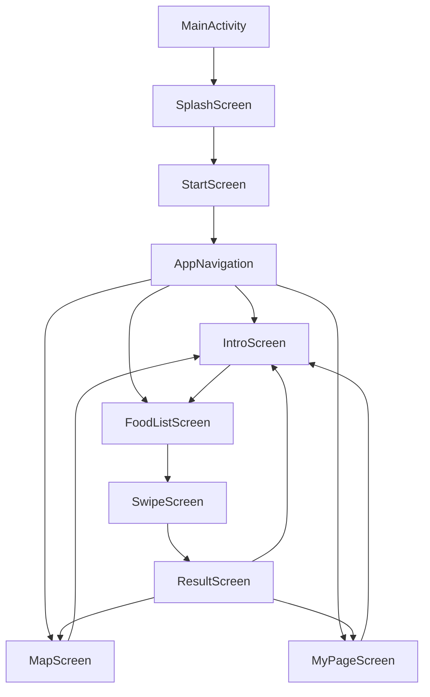

# 메추리알 (Mechuri Egg)

## 🥚 메뉴는 추려서 우리가 알려줄게! 🥚

혹시 식사시간 보다 메뉴를 고르는 데 더 많은 시간을 할애하고 계시진 않으신가요?
저희는 먹고 싶은 메뉴를 스와이프 형식으로 선택해 당신의 시간을 절약해주는 어플리케이션을 개발했습니다.


## 📱 프로젝트 소개

메추리알은 사용자가 다양한 음식 중에서 자신이 좋아하는 음식을 선택하여 최종 우승 음식을 찾는 토너먼트 스타일의 게임 앱입니다. 직관적인 스와이프 인터페이스를 통해 재미있게 게임을 즐길 수 있으며, 선택한 음식에 대한 주변 음식점 정보도 지도에서 확인할 수 있습니다.

### 주요 특징

- 🎮 **스와이프 기반 토너먼트 게임**: 직관적인 스와이프 제스처로 음식을 선택
- 🍽️ **다양한 음식 카테고리**: 한식, 중식, 일식, 양식, 아시안 등 다양한 음식 제공
- 🗺️ **지도 연동**: Kakao Maps를 활용한 주변 음식점 검색
- 📊 **우승 기록 관리**: 마이페이지에서 과거 우승 기록 확인
- 🎨 **모던한 UI**: Jetpack Compose와 Material 3를 활용한 현대적인 디자인
- 🚀 **완전한 Compose 아키텍처**: 모든 화면이 Jetpack Compose로 구현되어 일관된 사용자 경험 제공

## 🎯 주요 기능

### 1. 스플래시 화면 (SplashScreen)
- 앱 시작 시 1.5초간 스플래시 화면 표시
- FoodRepository 초기화

### 2. 인트로 화면 (IntroScreen)
- 앱 소개 및 사용 방법 안내
- 최근 우승 음식 표시
- 게임 시작 버튼

### 3. 음식 리스트 선택 (FoodListScreen)
- 카테고리별 음식 필터링 (한식, 중식, 일식, 양식, 아시안)
- 토너먼트에 참여할 음식 선택
- 최대 16개 음식 선택 가능
- 선택된 음식 개수 실시간 표시

### 4. 스와이프 게임 (SwipeScreen)
- 카드 스와이프를 통한 음식 선택
- 오른쪽 스와이프: 합격 (Like)
- 왼쪽 스와이프: 불합격 (Pass)
- 되돌리기 (Rewind) 기능
- 게임 스킵 기능
- 진행 상황 표시

### 5. 결과 화면 (ResultScreen)
- 최종 우승 음식 표시
- 우승 음식 정보 및 이미지
- 탈락한 음식들 그리드 표시
- 다시하기 및 마이페이지 이동 버튼
- 지도에서 찾기 버튼

### 6. 지도 화면 (MapScreen)
- Kakao Maps를 활용한 지도 표시
- 우승 음식에 대한 주변 음식점 검색
- 마커를 통한 음식점 위치 표시
- 음식점 상세 정보 확인
- 현재 위치 기반 검색

### 7. 마이페이지 (MyPageScreen)
- 과거 우승 기록 목록 (날짜순 정렬)
- 날짜별 우승 음식 확인
- 우승 기록 삭제 기능
- 지도에서 찾기 기능

## 🛠️ 기술 스택

### 언어 및 프레임워크
- **Kotlin**: 프로그래밍 언어
- **Jetpack Compose**: UI 프레임워크 (모든 화면 Compose 기반)
- **Material 3**: 디자인 시스템

### 주요 라이브러리
- **Navigation Compose**: 화면 간 네비게이션
- **Coil**: 이미지 로딩 (Compose 화면에서 사용)
- **Glide**: 이미지 프리로딩 (ImagePreloader에서 사용)
- **Retrofit**: REST API 통신 (Kakao Local API)
- **Gson**: JSON 파싱
- **Kakao Maps SDK**: 지도 표시 및 검색
- **Kakao SDK v2**: 키 해시 유틸리티

### 데이터 저장
- **SharedPreferences**: 사용자 설정 및 게임 상태 저장
- **Assets**: 음식 이미지 및 JSON 데이터

### API
- **Kakao Local API**: 음식점 검색
- **Kakao MAP API**: 카카오 맵 불러오기

## 📋 시스템 요구사항

- **최소 SDK**: 26 (Android 8.0 Oreo)
- **타겟 SDK**: 36 (Android 15)
- **컴파일 SDK**: 36
- **Java 버전**: 11
- **Kotlin Compiler Extension**: 1.5.8

## 🚀 설치 및 실행 방법

### 1. 프로젝트 클론

```bash
git clone <repository-url>
cd 2025Winter_1st-main
```

### 2. API 키 설정

프로젝트 루트에 `local.properties` 파일을 생성하고 다음 내용을 추가하세요:

```properties
KAKAO_REST_API_KEY=your_kakao_rest_api_key
KAKAO_MAP_KEY=your_kakao_map_key
```

#### Kakao API 키 발급 방법

1. [Kakao Developers](https://developers.kakao.com/)에 접속하여 로그인
2. 내 애플리케이션 만들기
3. 앱 키에서 REST API 키 확인
4. 플랫폼 설정에서 Android 플랫폼 추가
   - 패키지명: `com.example.foodworldcup`
5. 카카오 로그인 활성화 (필요한 경우)
6. Kakao Maps API 활성화

### 3. 빌드 및 실행

```bash
# Gradle Wrapper를 사용하여 빌드
./gradlew assembleDebug

# 또는 Android Studio에서
# Build > Make Project
```

### 4. 앱 실행

- Android Studio에서 에뮬레이터 또는 실제 기기 연결 후 실행
- 또는 빌드된 APK 파일 설치: `app/build/outputs/apk/debug/app-debug.apk`

## 📁 프로젝트 구조

```
app/src/main/
├── java/com/example/foodworldcup/
│   ├── api/
│   │   └── MapApiHelper.kt          # Kakao Local API 호출
│   ├── data/
│   │   ├── Food.kt                   # 음식 데이터 모델
│   │   ├── FoodRepository.kt         # 음식 데이터 관리 (싱글톤)
│   │   ├── MapSelectedFood.kt       # 지도 선택 음식 모델
│   │   └── Restaurant.kt             # 음식점 데이터 모델
│   ├── game/
│   │   └── GameStateManager.kt       # 게임 상태 관리
│   ├── ui/
│   │   ├── compose/                  # Compose 화면들
│   │   │   ├── AppNavigation.kt     # 메인 네비게이션 (NavHost, NavigationBar)
│   │   │   ├── StartScreen.kt       # 시작 화면 (SplashScreen + AppNavigation)
│   │   │   ├── SplashScreen.kt      # 스플래시 화면
│   │   │   ├── IntroScreen.kt       # 인트로 화면
│   │   │   ├── FoodListScreen.kt    # 음식 리스트 화면
│   │   │   ├── SwipeScreen.kt       # 스와이프 게임 화면
│   │   │   ├── ResultScreen.kt      # 결과 화면
│   │   │   ├── MapScreen.kt         # 지도 화면
│   │   │   ├── MyPageScreen.kt      # 마이페이지 화면
│   │   │   ├── Theme.kt             # 테마 설정
│   │   │   └── Color.kt              # 색상 정의
│   │   └── MainActivity.kt          # 메인 Activity (최소화된 진입점)
│   └── utils/
│       ├── PreferenceManager.kt     # SharedPreferences 관리
│       ├── ImageLoader.kt            # 이미지 로딩 유틸리티
│       ├── BitmapUtils.kt            # 비트맵 처리 유틸리티
│       ├── ImagePreloader.kt         # 이미지 프리로딩 (Glide 사용)
│       ├── KakaoMapHelper.kt         # Kakao Maps 헬퍼
│       └── DateFormatter.kt          # 날짜 포맷팅
├── assets/
│   ├── final_foods.json              # 음식 데이터 JSON
│   ├── food_images/                  # 음식 이미지
│   ├── food_character_images/        # 음식 캐릭터 이미지
│   └── [기타 이미지 파일들]
└── res/
    └── [리소스 파일들]
```

## 🔄 앱 네비게이션 플로우



### 네비게이션 구조
- **Bottom Navigation Bar**: Intro, FoodList, Map, MyPage 탭 간 이동
- **NavHost**: 화면 간 네비게이션 관리
- **StartScreen**: 앱 시작 시 SplashScreen 표시 후 AppNavigation으로 전환

## 📖 사용 방법

### 1. 게임 시작
1. 앱 실행 후 스플래시 화면이 표시됩니다 (1.5초)
2. 인트로 화면에서 "메뉴 추리기!" 버튼 클릭
3. 음식 리스트 화면에서 카테고리를 선택하거나 전체 음식 중에서 선택
4. 토너먼트에 참여할 음식들을 선택 (최대 16개)
5. "시작하기" 버튼 클릭

### 2. 스와이프 게임
1. 카드를 오른쪽으로 스와이프: 합격 (Like)
2. 카드를 왼쪽으로 스와이프: 불합격 (Pass)
3. 되돌리기 버튼: 마지막 선택 취소
4. 스킵 버튼: 현재까지 합격된 음식만으로 진행
5. 진행 상황은 상단의 ProgressIndicator로 확인 가능

### 3. 결과 확인
1. 모든 음식을 선택하면 결과 화면으로 이동
2. 우승 음식 확인
3. 탈락한 음식들 그리드 확인
4. "지도에서 찾기" 버튼으로 주변 음식점 검색
5. "마이페이지"에서 우승 기록 확인
6. "다시하기" 버튼으로 새 게임 시작

### 4. 지도에서 음식점 찾기
1. 지도 화면에서 우승 음식에 대한 주변 음식점 표시
2. 마커 클릭으로 음식점 상세 정보 확인
3. 현재 위치 기반 검색
4. 검색 결과 리스트 확인

### 5. 마이페이지
1. 과거 우승 기록을 날짜순으로 확인
2. 각 기록을 클릭하여 상세 정보 확인
3. 삭제 버튼으로 기록 삭제
4. "지도에서 찾기" 버튼으로 해당 음식의 주변 음식점 검색

## 🔧 주요 클래스 설명

### MainActivity
앱의 진입점입니다. Intent에서 `navigate_to` 파라미터를 추출하여 `StartScreen`에 전달합니다. 모든 UI 로직은 Compose로 구현되어 있어 Activity는 최소한의 역할만 수행합니다.

### StartScreen
앱의 시작 화면 Composable입니다. 다음 기능을 수행합니다:
- SplashScreen 표시 (1.5초)
- FoodRepository 초기화
- Intent에서 `passed_food_ids` 추출 및 저장
- Kakao 키 해시 로깅
- AppNavigation으로 전환

### FoodRepository
음식 데이터를 관리하는 싱글톤 객체입니다. `final_foods.json` 파일에서 음식 데이터를 로드하고, 카테고리별 필터링 기능을 제공합니다.

### GameStateManager
게임 상태를 관리하는 클래스입니다. 스와이프 히스토리를 관리하여 Rewind 기능을 지원하며, 남은 음식, 합격된 음식, 탈락된 음식 리스트를 관리합니다.

### PreferenceManager
SharedPreferences를 쉽게 사용하기 위한 헬퍼 클래스입니다. 선택된 음식 ID, 게임 상태, 지도 선택 음식 등의 데이터를 저장하고 불러옵니다.

### MapApiHelper
Kakao Local API를 호출하여 음식점 검색 기능을 제공합니다. Retrofit을 사용하여 REST API 통신을 처리합니다.

### AppNavigation
앱의 전체 네비게이션 구조를 관리하는 Composable입니다. `NavHost`와 `NavigationBar`를 사용하여 화면 간 이동을 처리합니다.

## 🐛 문제 해결 (Troubleshooting)

### 빌드 오류
- **문제**: `mergeDebugAssets` 오류
  - **해결**: `./gradlew clean` 실행 후 다시 빌드

### API 키 오류
- **문제**: Kakao Maps가 표시되지 않음
  - **해결**: `local.properties` 파일에 올바른 API 키가 설정되어 있는지 확인
  - 키 해시가 올바르게 등록되었는지 확인 (Logcat에서 `KakaoKeyHash` 태그 확인)

### 이미지 로드 오류
- **문제**: 음식 이미지가 표시되지 않음
  - **해결**: `assets` 폴더에 이미지 파일이 올바르게 위치해 있는지 확인
  - 이미지 경로가 `final_foods.json`의 `img` 필드와 일치하는지 확인

### Compose 관련 오류
- **문제**: `@Composable` 함수 호출 오류
  - **해결**: 모든 Compose 화면이 올바른 패키지에 위치하고 `@Composable` 어노테이션이 있는지 확인

## 📝 데이터 구조

### Food 데이터 모델
```kotlin
data class Food(
    val id: Int,
    val name: String,
    val category: String,
    val imagePath: String?,
    val characterImagePath: String?
)
```

### Restaurant 데이터 모델
```kotlin
data class Restaurant(
    val id: String,
    val name: String,
    val address: String,
    val latitude: Double,
    val longitude: Double,
    val phoneNumber: String? = null,
    val rating: Double? = null,
    val distance: Int? = null
)
```

### JSON 데이터 형식
`final_foods.json` 파일은 다음과 같은 구조를 가집니다:
```json
{
  "id": "한식_01",
  "name": "비빔밥",
  "cuisine": "한식",
  "attributes": {
    "spicy": false,
    "healthy": true
  },
  "img": "./food_images/한식/비빔밥.png",
  "character_img": "./food_character_images/한식/비빔밥_캐릭터누끼.png"
}
```

## 🏗️ 아키텍처 특징

### Compose-First 아키텍처
- 모든 UI가 Jetpack Compose로 구현되어 일관된 사용자 경험 제공
- 레거시 View 기반 코드 제거로 유지보수성 향상
- Material 3 디자인 시스템 적용

### 단일 Activity 패턴
- `MainActivity`만 존재하며, 모든 화면은 Compose로 구현
- Navigation Compose를 통한 화면 전환
- Intent를 통한 딥링크 지원

### 데이터 관리
- `FoodRepository`: 싱글톤 패턴으로 음식 데이터 관리
- `PreferenceManager`: SharedPreferences를 통한 사용자 데이터 저장
- `GameStateManager`: 게임 상태 관리

## 👥 프로젝트 구성원

박세윤 (카이스트 22 , 전산학부)
이건 (한양대학교 24, 정보공학)

## 📄 라이선스

이 프로젝트는 현재 라이선스가 지정되지 않았습니다.

## 🔮 향후 계획

- [ ] 다크 모드 지원
- [ ] 음식 상세 정보 추가
- [ ] 소셜 공유 기능
- [ ] 통계 및 분석 기능
- [ ] 다국어 지원
- [ ] 애니메이션 개선
- [ ] 오프라인 모드 지원

## 📞 문의

프로젝트에 대한 문의사항이 있으시면 이슈를 등록해주세요.

---

**메추리알** - 메뉴는 추려서 우리가 알려줄게! 🥚
